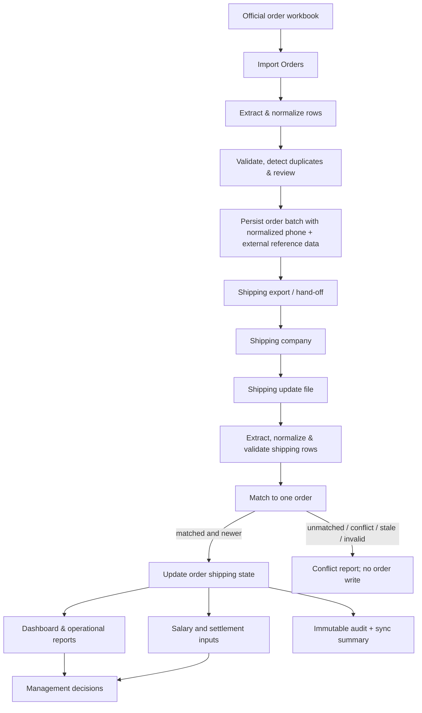

# Shipping Integration Design Proposal

**Status:** Approved architecture — implementation in progress on `feature/import-improvements`. Production activation remains gated by the phase-two tests and Firebase UAT described below.

## 1. Goal and design principles

The shipping stage must make an order traceable from the official order-import file through dispatch and delivery, without changing the meaning of historical data or silently updating the wrong order.

The design is governed by these principles:

- The source workbook `ID` is external reference data only. It is excluded from shipping matching and update selection.
- A shipping update is applied only to one unambiguous order and only when it is newer than the order's known shipping state.
- Every import is previewed, idempotent, auditable, and compatible with existing order-batch documents.
- Missing, ambiguous, invalid, and stale updates are visible outcomes, never silent fallbacks.

## 2. End-to-end order and shipping workflow



### Workflow detail

1. **Import Orders:** the existing official workbook is parsed and reviewed before confirmation.
2. **Extraction and validation:** each accepted row is normalized and stored with order metadata. The imported source `ID` remains external reference data only; it is not used by shipping matching.
3. **Shipping export / hand-off:** after approval of the provider contract, the system exports the provider-required columns and a normalized customer phone. The phone is the approved automatic correlation key for shipping updates; the external ID may be included only as a non-matching reference where useful.
4. **Shipping company:** creates or updates its shipment and returns its own tracking number and status updates.
5. **Shipping update import:** the user selects an update file and source. It is normalized, deduplicated, validated, and matched by normalized phone before any order is modified.
6. **Order update:** only unambiguous, newer matched rows write the optional shipping data. The imported source row remains traceable through its fingerprint and sync record.
7. **Reports, Dashboard, Salary:** operational views read the shipping state. Any financial eligibility rule must be explicitly approved; shipping integration itself must not silently alter salary or settlement values.

## 3. Matching strategy comparison and final architecture decision

### Candidate strategies

| Strategy | Advantages | Disadvantages | Risk | Impact on existing data |
| --- | --- | --- | --- | --- |
| **External Order ID only** | Simple, already present in the import file, easy to explain. | It originates outside this system; may be missing, reused, edited, or refer to a different lifecycle. | High when source IDs are not globally stable. | Works as a fallback for current data but must not become the internal primary key. |
| **Customer name + phone** | Commonly present in operational files; useful for human review. | Names vary; phone values may be blank, shared, reformatted, or reused. | High for automatic writes. | Can be normalized and displayed as evidence; no migration required. |
| **Composite business key** (`externalId + normalized phone + order date/month`, optionally amount) | Improves confidence for legacy rows where no internal correlation was exchanged. | Source changes or missing components cause false negatives; a poorly chosen composite can still collide. | Medium as a fallback, high if treated as a primary key. | Read-only derivation from existing order fields; no destructive change. |
| **Tracking number only** | Strong shipment reference after the carrier creates it; provider-native and usually unique. | It is unavailable before the first carrier update and may be corrected by the provider. | Low as a reference, but unsuitable as the initial automatic match. | Optional new field; legacy records simply have no tracking reference. |
| **Generated internal `orderId` exchanged with provider** | Stable system ownership and useful for future integrations/audits. | Requires provider support and does not repair historic exports that lack it. | Low in systems that adopt it, but it is not the approved strategy for this provider integration. | May remain stored; no migration is required for shipping matching. |

### Final approved policy: phone-only deterministic matching

The approved implementation matches an incoming shipping row to an **open** order by normalized customer phone only. It must:

1. Convert Arabic and English numerals to one representation.
2. Remove spaces, hyphens, and other presentation punctuation.
3. Remove the Egyptian `+20` country prefix (and normalize its common equivalent forms) before comparison.
4. Search open orders only using the normalized phone value.
5. Update only when exactly one open order matches; two or more matches are a `conflict`, and zero matches are `unmatched`.

Neither the official workbook's external Order ID nor an internal `orderId` participates in shipping matching or update selection. Customer name, date, amount, and address can appear as reviewer evidence but must not change the automatic decision.

The tracking number is captured on the matched order at its first valid shipping update and becomes that order's primary shipment reference thereafter. It is retained for display, carrier reconciliation, and audit; it does not replace the approved phone-only automatic matching policy unless a future architecture decision explicitly changes it.

The matching service produces `matched`, `unchanged`, `unmatched`, `conflict`, `invalid`, or `stale`. Only `matched` changes an order.

## 4. Firestore design

### Existing documents

Existing order items remain embedded in:

```text
monthly_reports/{monthId}/orderBatches/{batchId}
```

The shipping stage does not replace or move existing batches. It updates an order item inside its existing batch using the application's established order mutation path.

### Optional fields added to an order item

```text
shipping: {
  trackingNumber: string | null,
  governorate: string | null,
  status: ShippingStatus | null,
  sourceUpdatedAt: Timestamp | null,
  lastSyncedAt: Timestamp | null,
  source: string | null,
  sourceRowHash: string | null,
  lastSyncId: string | null
}
```

- `sourceUpdatedAt` is the update time supplied by the shipping provider.
- `lastSyncedAt` is the server write time of this system.
- `sourceRowHash` identifies a normalized provider row and makes repeated imports idempotent.
- `lastSyncId` connects an order update to its import summary.
- The nested object is optional. Legacy orders remain valid with no shipping data.

### New collection

Create an auditable summary collection, not a duplicate order store:

```text
monthly_reports/{monthId}/shippingSyncs/{syncId}
```

Each summary stores: provider/source, file name and file fingerprint, actor, started/completed times, matched/updated/unchanged/unmatched/conflict/invalid/stale counts, and a compact row-level issue reference or bounded error list. It must not replicate full order arrays.

### Migration and backward compatibility

- **No destructive migration.** There is no batch rewrite and no removal/renaming of legacy fields.
- The UI will dual-read any pre-existing flat shipping values and the new `shipping` object. New writes use the nested object and preserve flat legacy values.
- No `orderId` migration is required for shipping matching. The imported external source ID and any existing internal identifier remain reference data only.

### Indexes

No new Firestore index is required for the initial design because matching reads the selected month's existing authorized batches and the sync list is scoped to one month. If an approved UI later queries `shippingSyncs` by source/status/date, the required composite index will be added together with that query and tested in the emulator.

### Rules and write constraints

- Add a distinct shipping-import capability; it must not be implied by ordinary order editing.
- Require active authorized users and preserve existing locked/archived month denials.
- Chunk writes within Firestore limits. Use transactions only for compare-and-write decisions that need atomic stale-update protection.
- Write audit information and sync summary only with authorized changes; unresolved rows produce a summary but no order update.

## 5. Shipping status lifecycle

### Canonical supported statuses

| Status | Meaning | Allowed next states |
| --- | --- | --- |
| `Pending` | Order is eligible for shipping but no confirmed provider shipment exists. | `Created`, `Cancelled`, `Unknown` |
| `Created` | Provider shipment/tracking number was created and saved on the uniquely phone-matched order. | `Picked Up`, `Cancelled`, `Unknown` |
| `Picked Up` | Carrier received the parcel. | `In Transit`, `Returned`, `Cancelled`, `Unknown` |
| `In Transit` | Parcel is moving through the carrier network. | `Delivered`, `Returned`, `Cancelled`, `Unknown` |
| `Delivered` | Delivery succeeded; terminal operational state. | No automatic transition; correction requires a reviewed newer provider event. |
| `Returned` | Parcel returned to sender; terminal operational state. | No automatic transition; correction requires a reviewed newer provider event. |
| `Cancelled` | Shipment was cancelled before a final delivery/return. | No automatic transition; correction requires a reviewed newer provider event. |
| `Unknown` | Provider status is unsupported, missing, or cannot be normalized. | Any non-unknown status with a newer source event. |

The persisted UI labels remain backward-compatible Arabic values: `لم يتم التحديث`, `تم الإنشاء`, `تم الاستلام`, `في الشحن`, `تم التسليم`, `مرتجع`, `ملغي`, and `غير معروف`, respectively. Provider text is normalized into those values and the original provider text is retained as `shipping.rawStatus`.

### Transition rules

- Provider-specific labels are mapped to the canonical statuses in one shared mapping table.
- A transition is accepted only when its source timestamp is newer than the persisted `shipping.sourceUpdatedAt`; if the provider gives no timestamp, the import run time is not allowed to overwrite a known timestamped update automatically.
- Terminal states (`Delivered`, `Returned`, `Cancelled`) are protected against automatic regression. A contradictory later provider event is reported as a conflict for review.
- `Unknown` never overwrites a recognized status unless explicitly approved in review.

## 6. System-wide effect of shipping updates

| Module | Initial effect | Guardrail |
| --- | --- | --- |
| Dashboard | Adds shipment-status KPIs, last-sync health, and unresolved-update count when data exists. | Empty/legacy state remains safe; no full-batch scans outside selected month. |
| Reports | Enables operational delivered/returned/in-transit breakdowns and provider reconciliation. | Historical reports retain their original figures unless a report explicitly opts into shipping metrics. |
| Salary | No automatic salary formula change in the first shipping release. | Any delivered/returned eligibility or bonus rule is a separate approved salary-policy change with regression coverage. |
| Transactions | No automatic transaction creation or modification. | Financial movement requires an explicit approved workflow, not a shipment status side effect. |
| Settlements | Can display shipping evidence for a later reconciliation workflow. | No automatic settlement amount/status change in the first release. |
| Audit | Records sync start/end, file fingerprint, counts, applied changes, and conflicts. | Audit records remain append-only and avoid customer-sensitive payload duplication. |

## 7. Conflict handling

| Situation | Required behavior | Order write |
| --- | --- | --- |
| No open order with the normalized phone | Mark row `unmatched`, retain it in the sync report, offer no guessed match. | None |
| More than one open order with the normalized phone | Mark row `conflict`, list safe matching evidence for manual review. | None until an explicit manual resolution is approved in the UI. |
| Missing required shipping data | Mark row `invalid`; accept other valid rows in the file. A missing optional field never clears a stored value. | None for invalid row |
| Same file imported twice | Detect file fingerprint and row hashes; return `unchanged`/duplicate outcome and do not create duplicate updates or summaries that imply changes. | None |
| An old update arrives after a new one | Compare normalized provider timestamp to `sourceUpdatedAt`; mark as `stale`. | None |
| Same timestamp with different values | Mark as `conflict` for review; do not use import order as a tie-breaker. | None |
| Provider gives an unrecognized status | Preserve raw status in issue details, map canonical state to `Unknown`, and do not regress a recognized state. | Only when safely creating a first shipping state; otherwise none |
| Tracking number collides | Mark `conflict` and require review; phone-only selection is never overridden by a tracking collision. | None |

## 8. Pre-implementation test plan

### Normal cases

- Unique open-order match by a normalized Egyptian phone number.
- Arabic/English digits, `+20`, spaces, and hyphens all normalize to the same phone identity.
- Tracking number is stored on the uniquely phone-matched order on the first valid update and then updated as shipment reference data.
- Each valid canonical lifecycle transition and governorate/tracking update.
- Dashboard, Orders, and report display with no shipping data, partial shipping data, and complete shipping data.

### Duplicate and idempotency cases

- Exact same file twice.
- Same shipping row twice in one file.
- Same shipment update from differently named files.
- One new provider update after a previously imported update.
- Sync-summary and Audit count verification after each case.

### Conflict and missing-data cases

- No matching phone, multiple open orders with the same phone, tracking collision, source-ID reuse, and customer name collision.
- Missing tracking number, missing source timestamp, invalid date, blank/invalid status, blank governorate, malformed provider row, and reordered columns.
- Out-of-order updates, equal-time contradictory updates, terminal-state regression, and unknown provider status.

### Scale, performance, and failure cases

- Large files at and above a Firestore write-chunk boundary; assert stable memory usage, accurate totals, and no partial silent completion.
- Mid-run write failure, network interruption, permission denial, locked/archived month denial, and browser refresh during preview.
- Verify resumability through idempotent row hashes rather than blind retry.

### Rollback scenarios

- Before a confirmed write, cancelling the preview creates no order change.
- If a chunk fails, show the exact completed/failed scope in the sync summary; never claim a full rollback that did not occur.
- A corrective provider file is the normal rollback mechanism for a completed shipment update. Any administrative reversal must be an explicit audited action with before/after values and transaction coverage.
- Regression-test Dashboard, Reports, Salary, Transactions, Settlements, Audit, month lock/archive, permissions, and legacy order rendering after every shipping fix.

## 9. Implementation sequence after approval

1. Confirm the provider's real schema, status vocabulary, timestamps, and phone-number column.
2. Apply the approved phone-only matching policy, field names, canonical lifecycle, permissions, and financial non-side-effect rule in this document.
3. Implement and unit-test the shared parser, normalizer, status mapper, fingerprinting, and matching service.
4. Add Firestore-compatible writes, Rules, audit/sync summaries, and emulator tests.
5. Add preview/review UI and read-only Dashboard/Orders/Reports integration.
6. Run controlled Firebase production UAT with a non-financial test batch, inspect Firestore and audit results, then request approval before activating any salary/transaction/settlement policy.

## Production activation gate

The architecture is approved. Deployment remains blocked until the implementation has passed the local, Rules, browser, and Firebase UAT scenarios in this document; it must then be committed and pushed on the existing feature branch without merging it into `main`.
